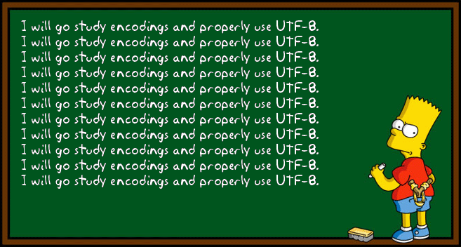

<div align="center"><br></div>

----

# TextEncoder

An implementation of the [WHATWG Encoding Specification](https://encoding.spec.whatwg.org) in PHP.

> The UTF-8 encoding is the most appropriate encoding for interchange of Unicode, the universal coded character set.

We agree with this statement. The goal of this project is to detect the current encoding of a string or document. If it isn't UTF-8, make it easy to convert to UTF-8.

## Badges

### Health

[](https://github.com/simplepie/text-encoder/issues)
[](https://github.com/simplepie/text-encoder/pulls)
[](https://github.com/simplepie/text-encoder/graphs/contributors)
[](https://github.com/simplepie/text-encoder/pulse/monthly)
[](https://github.com/simplepie/text-encoder/commits/master)
[](https://github.com/simplepie/text-encoder/commits)

### Quality

[](https://travis-ci.org/simplepie/text-encoder)
[](https://coveralls.io/github/simplepie/text-encoder)
[](https://scrutinizer-ci.com/g/simplepie/text-encoder)
[](https://insight.symfony.com/projects/@@INSIGHT@@)

### Social

[](https://twitter.com/skyzyx)
[](https://twitter.com/intent/follow?screen_name=simplepie_ng)
[](https://medium.com/simplepie-ng)
[](https://github.com/simplepie/text-encoder/stargazers)

### Compliance

[](https://github.com/simplepie/text-encoder/blob/master/LICENSE.md)

## Workflow



Before we can convert content to UTF-8, we first need to understand the _current_ character encoding so that we know what we need to convert _from_. In order to determine this, we rely on a few specific signals:

1. The `Content-Type` header in an HTTP response.
1. The XML prologue.
1. Well-known byte sequences in certain encodings.

Since character encodings can be fairly esoteric, and a understanding of encodings is limited, it is common that an HTTP response or XML prologue will _lie_ about their encoding. As such, while they _may_ be helpful, _content sniffing_ provides the most confident results.

Once we have high confidence in the _input_ encoding, converting to UTF-8 becomes trivial.

## Specifications

* [UTS #22: Unicode Character Mapping Markup Language, §1.4: Charset Alias Matching](https://www.unicode.org/reports/tr22/tr22-8.html)
* [Extensible Markup Language (XML) 1.0 (Fifth Edition), Appendix F.1: “Detection Without External Encoding Information”](https://www.w3.org/TR/xml/#sec-guessing-no-ext-info)
* [HTML Living Standard: Determining the Character Encoding](https://html.spec.whatwg.org/multipage/parsing.html#determining-the-character-encoding)
* [Encoding Living Standard](https://encoding.spec.whatwg.org)
* [BCP-47: Tags for Identifying Languages](https://tools.ietf.org/html/bcp47)
* [FAQ: UTF-8, UTF-16, UTF-32 & BOM](https://unicode.org/faq/utf_bom.html)

## Coding Standards

PSR-1/2/5/12/19 are a solid foundation, but are not an entire coding style by themselves. We automate a large part of our style requirements using [PHP CS Fixer](http://cs.sensiolabs.org) and [PHP CodeSniffer](https://github.com/squizlabs/PHP_CodeSniffer). (The things that we cannot yet automate are documented in the [SimplePie NG Coding Standards](https://github.com/simplepie/simplepie-ng-coding-standards).)

These can be applied/fixed automatically by running the (lightweight) linter:

```bash
make lint
```

Additionally, in our quest to write excellent code, we use a variety of tools to help us catch issues with what we've written, including:

| Type | Description |
| ---- | ----------- |
| Linting Tools | [PHP CS Fixer](http://cs.sensiolabs.org), [PHP CodeSniffer](https://github.com/squizlabs/PHP_CodeSniffer) |
| QA Tools | [PDepend](https://github.com/pdepend/pdepend), [PHPLOC](https://github.com/sebastianbergmann/phploc), [PHP Copy/Paste Detector](https://github.com/sebastianbergmann/phpcpd), [PHP Code Analyzer](https://github.com/wapmorgan/PhpCodeAnalyzer) |
| Static Analysis | [Phan](https://github.com/phan/phan), [PHPStan](https://github.com/phpstan/phpstan), [Psalm](https://github.com/vimeo/psalm), [PHP Dependency Analysis](https://github.com/mamuz/PhpDependencyAnalysis) |

These reports can be generated by running the (heavyweight) analyzer:

```bash
make analyze
```

## Please Support or Sponsor Development

The SimplePie project is a labor of love. Development of the next-generation of SimplePie was started in June 2017 as because it's a project I love, and I believe our community would benefit from this tool.

If you use SimplePie — especially to make money — it would be swell if you could kick down a few bucks. As the project grows, and we start leveraging more services and architecture, it would be great if it didn't all need to come out of my pocket.

You can also sponsor the development of a particular feature. If there's a feature that you want to see implemented, and I believe it's the right fit for the SimplePie project, you can sponsor the development of the feature to get it prioritized.

Your contributions are greatly and sincerely appreciated. See the **Sponsor** button along the top of the page for more information.

